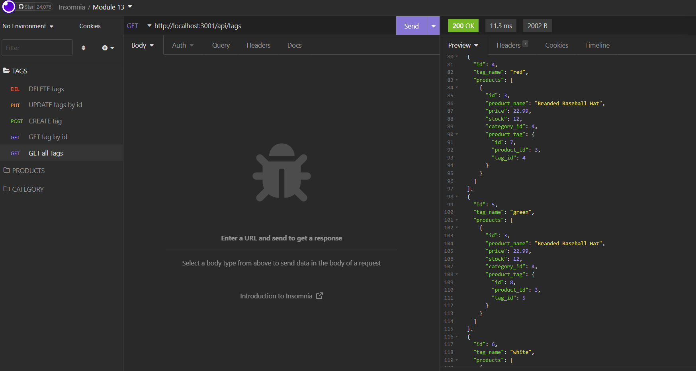

# E-commerce Back End Starter Code

## Table of Contents

- [**Description**](#-description)
- [**Features**](#-features)
- [**Installation**](#-installation)
- [**Usage**](#-usage)
- [**Demo Video**](#-demo-video)
- [**Author**](#-author)

## 📑 Description

As a manager at an internet retail company, would you want a back end for your e-commerce website that uses the latest technologies so that your company can compete with other e-commerce companies?

If your answer is **"YES"**, feel free to grab my application to handle the backend for your website!

**NOTES** You can test the routes for adding and updating **ONLY** through **Insomnia**.

## ❗ Features

Followings are the routes you can test through the app.

1. **Products Routes**: `/api/products` +

   - **GET All Products**: `/`
   - **Get a Product**: `/:id`
   - **Add a New Product**: `/`
   - **Update a Product**: `/:id`
   - **Delete a Product**: `/:id`  
     **Notes**: `/:id` is the number you pick from the list of the Products.

2. **Categories Routes**: `/api/categories` +

   - **GET All Categoryies**: `/`
   - **Get a Category**: `/:id`
   - **Add a New Category**: `/`
   - **Update a Category**: `/:id`
   - **Delete a Category**: `/:id`  
     **Notes**: `/:id` is the number you pick from the list of the Categories.

3. **Tags Routes**
   - **GET All Tags**: `/`
   - **Get a Tag**: `/:id`
   - **Add a New Tag**: `/`
   - **Update a Tag**: `/:id`
   - **Delete a Tag**: `/:id`  
     **Notes**: `/:id` is the number you pick from the list of the Tags.

## 💾 Installation

You would need to have the following **`npm`** packages for this app.

- **`mysql`**
- **`mysql2`**
- **`express`**
- **`sequelize`**
- **`dotenv`**

You already have all the packages in your **`package.json`**?  
Then just type **`npm i`** in your terminal.

## 💻 Usage

Once you **`git clone`** this repository, make sure you create **`.env`** file in your cloned directory, and have following codes in your **`.env`**.

```
DB_NAME=
DB_USER=
DB_PW=
```

**Notes**

- **`DB_NAME`**: the name of the database in **`./db/schema.sql`**
- **`DB_USER`**: the root user of your **`MySQL`** Database.
- **`DB_PW`**: the password of your **`MySQL`** Account.

Then seed the sample data by running the following command in your terminal.

- **`npm run seed`**

Finished all the steps above?  
Type and run the following command in your terminal.

- **`npm start`**

## 🎬 Demo Video

If you want to watch the demo video on how to use the application, check out the video below.

**CLICK THE IMAGE BELOW**  
[](https://drive.google.com/file/d/1Mcbz5MSMRPDd9E2Tb-rCOJ5V3UzHOGL3/view)

## 😎 Author

🖐 If you have any question about me or my project, feel free to contact me!

- **Merkisha Wilkinson**
  - Portfolio: [**Portfolio**](https://mwilk94.github.io/professional_portfolio/) (to be updated)
  - Email: **merkisha94@gmail.com**
  - **Github**: [**mwilk94**](https://github.com/mwilk94)
